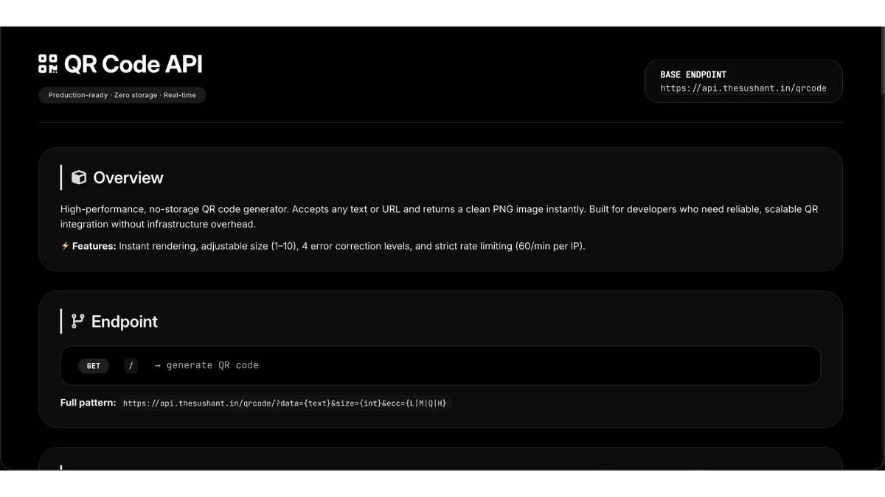
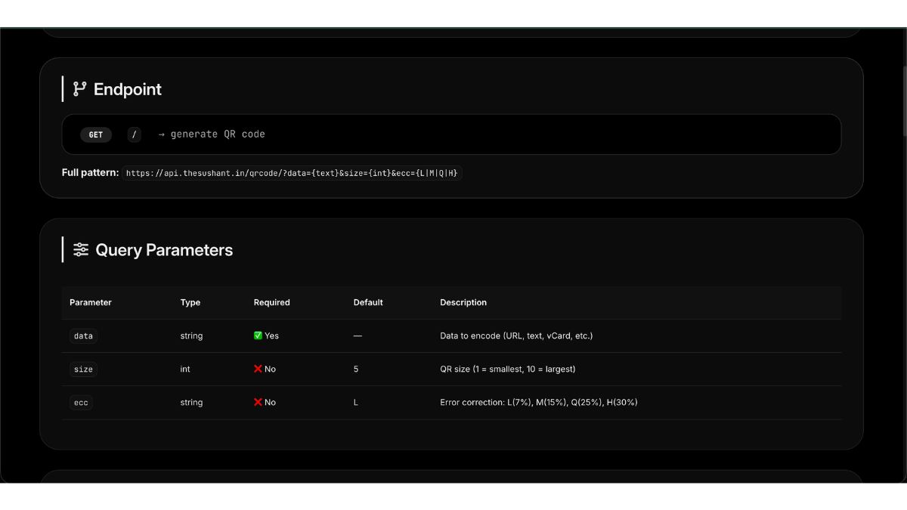
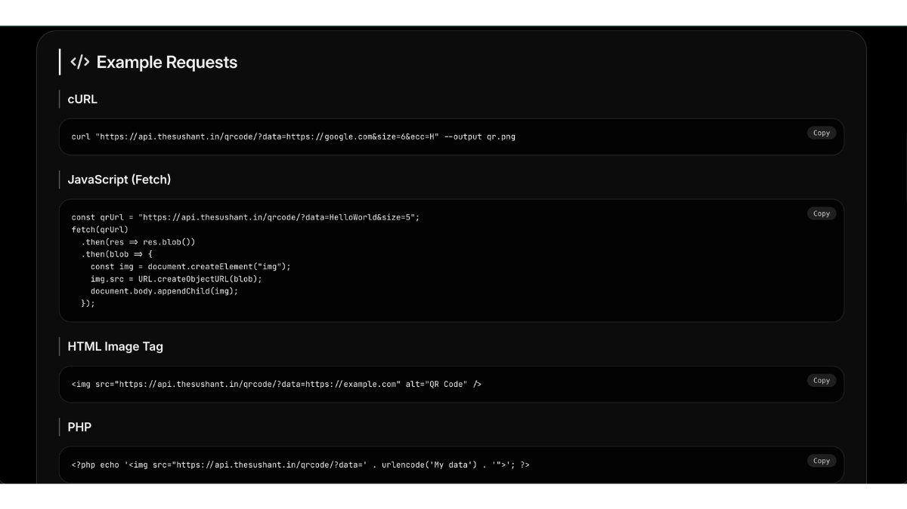
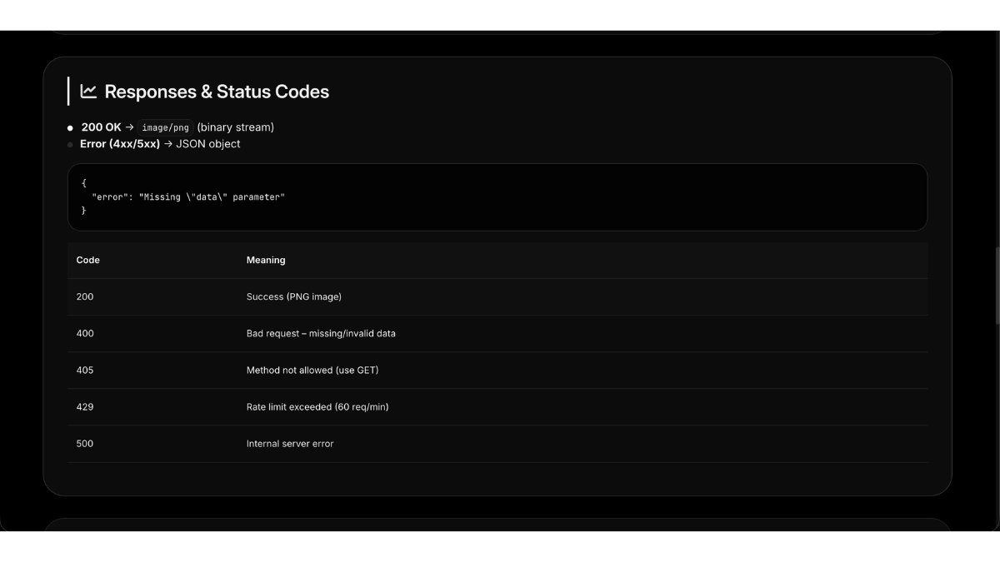
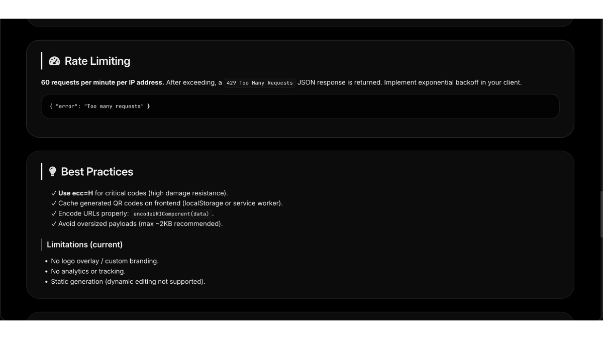
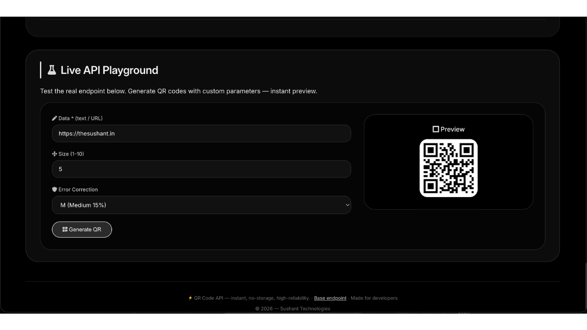

# QR Code API

A production-ready REST API for generating QR codes in real time. The API accepts any text or URL and instantly returns a PNG image without storing user data, making it suitable for websites, applications, and developer integrations.

---

## Overview

The QR Code API was built to provide a fast, lightweight, and reliable way to generate QR codes without requiring developers to manage QR generation libraries or infrastructure.

The service supports configurable sizes, multiple error correction levels, and developer-friendly endpoints while maintaining a stateless architecture with no persistent data storage.

---

## Key Features

### QR Code Generation

* Generate QR codes from text or URLs
* PNG image output
* Real-time processing
* Stateless architecture
* Zero data storage

### Developer Friendly

* Simple REST API
* GET endpoint
* Easy integration
* Multi-language examples
* Predictable responses

### Customization

* Adjustable QR size (1–10)
* Four error correction levels
* Browser compatible
* Mobile friendly

### Reliability

* Request validation
* HTTP status codes
* Rate limiting
* Production-ready endpoint

---

## Technology Stack

* PHP
* HTML
* CSS
* JavaScript
* REST API
* PNG Image Generation

---

## API Endpoint

```text
GET https://api.thesushant.in/qrcode/
```

### Query Parameters

| Parameter | Required | Description                         |
| --------- | -------- | ----------------------------------- |
| data      | ✅        | Text or URL to encode               |
| size      | ❌        | QR size (1–10)                      |
| ecc       | ❌        | Error correction level (L, M, Q, H) |

---

## Screenshots

### Homepage



### API Reference



### Code Examples



### Responses & Rate Limiting



### Best Practices



### Interactive Playground



---

## Request Flow

```text
Client
   │
   ▼
GET /qrcode
   │
   ▼
Validate Parameters
   │
   ▼
Generate QR Code
   │
   ▼
Return PNG Image
```

---

## Response

### Success

* HTTP 200
* PNG Image

### Error Responses

* 400 — Invalid or missing parameters
* 405 — Method not allowed
* 429 — Too many requests
* 500 — Internal server error

---

## Highlights

* Production-ready REST API
* Stateless architecture
* Zero data storage
* Configurable output
* Rate limited for reliability
* Developer-focused documentation
* Interactive API playground

---

## Future Improvements

* API key authentication
* Dynamic QR Codes
* Scan analytics
* Custom branding
* Logo overlays
* SVG output
* Color customization

---

## Status

Production-ready API actively serving QR code generation requests.

---

## Author

**Sushant Kumar**

Portfolio:
https://thesushant.in/portfolio

Website:
https://thesushant.in

API:
https://api.thesushant.in/qrcode
